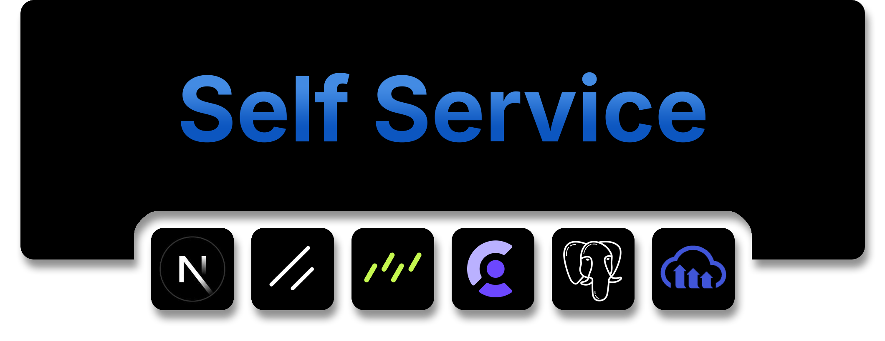

<details>
<summary style="font-size: 2.5em; font-weight: bold">Table of Contents</summary>

- [About](#about)
- [Features](#features)
- [Tech Stack](#tech-stack)
- [Installation](#installation)
- [Testing](#testing)
- [Database Structure](#database-structure)

</details>

---

## About

Self Service is a platform for companies to manage **support tickets** and **equipment requests** efficiently. Employees can submit support tickets and request items from an integrated shop, while managers review and approve requests. **Admins** oversee inventory and user management.

Authentication is handled via **Clerk**, supporting **Google, GitHub, and Email login** (password or OTP). **PostgreSQL (Drizzle ORM)** powers the database, and **Cloudinary** stores ticket screenshots. The UI is built with **shadcn**, providing a modern and accessible design.

## Features

- **Support Ticket System**: Employees and managers can create tickets for support staff.
- **Integrated Shop**: Employees can request equipment, which managers review and approve.
- **Role-Based Access**:
    - **Employees**: Submit support tickets and equipment requests.
    - **Managers**: Approve/reject equipment requests and submit tickets.
    - **IT-Support**: Manage support tickets.
    - **Admins**: Manage shop items, users, and system settings.
- **Authentication via Clerk**:
    - Login with **Google, GitHub, or Email (password/OTP)**.
- **Cloudinary Integration**: Attach screenshots to support tickets.
- **Next.js & API Routes**: Efficient handling of requests with server-side logic.
- **PostgreSQL + Drizzle ORM**: Robust and scalable database setup.

## Tech Stack

- **Frontend**: Next.js, React, Tailwind CSS + shadcn
- **Backend**: Next.js Server Actions
- **IAM**: Clerk
- **Database**: PostgreSQL (Drizzle ORM)
- **Storage**: Cloudinary (for ticket screenshots)
- **Testing**: Jest

## Installation

### Prerequisites

- Node.js (v18.18+)
- Next.js (v15)
- Cloudinary Account (provided below)
- Clerk Account (provided below)
- Docker (for PostgreSQL DB)

### Steps

1. Clone the repository:
    ```bash
    git clone <repository-url>
    cd <project-directory>
    ```
2. Install dependencies:

    ```bash
    npm install
    ```

3. Create a `.env.local` file in the root directory and configure it using the `.env.example` as a reference.

4. Start the PostgreSQL container:
    ```bash
    docker-compose --env-file ./.env.local up -d
    ```
5. Apply the database [migration file](./drizzle):
    ```bash
    npx drizzle-kit migrate
    ```
    Alternatively you can just push the schema without data to you db:
    ```bash
    npx drizzle-kit push
    ```
6. Build App:
    ```bash
     npm run build
    ```
7. Start server:
    ```bash
    npm run start
    ```
8. Open [http://localhost:3000](http://localhost:3000) with your browser and login with Clerk.

9. Select the Organization named `Self Service 2` and check it out. `Self Service 1` has no data to show multinenancy when switching.

## Testing
- Unit & Integration Tests & Frontend Tests: Jest
    ```bash
    npm test
    ```
- E2E Test: cypress
    ```bash
    npx cypress open 
    ```

## Database Structure

```plantuml
entity "Ticket" as Ticket {
    *id: serial [PK]
    --
    title: varchar(100)
    description: text
    status: ticketStatus
    ownerId: varchar(32)
}

entity "TicketConversation" as TicketConversation {
    *id: serial [PK]
    --
    ticketId: integer [FK] -> Ticket.id
    userId: varchar(32)
}

entity "TicketScreenshot" as TicketScreenshot {
    *id: serial [PK]
    --
    ticketId: integer [FK] -> Ticket.id
    url: varchar(255)
}

entity "Request" as Request {
    *id: serial [PK]
    --
    userId: varchar(32)
    status: requestStatus
    creationDate: timestamp
}

entity "ItemInRequestList" as ItemInRequestList {
    *id: serial [PK]
    --
    requestId: integer [FK] -> Request.id
    itemId: integer [FK] -> ShopItem.id
    status: itemInRequestListStatus
}

entity "Inventory" as Inventory {
    *id: serial [PK]
    --
    ownerId: varchar(32)
    itemId: integer [FK] -> ShopItem.id
    purchaseDate: timestamp
}

entity "ShopItem" as ShopItem {
    *id: serial [PK]
    --
    name: varchar(255)
    description: varchar(255)
    url: varchar(255)
    categoryId: integer [FK] -> ShopItemCategory.id
}

entity "ShopItemCategory" as ShopItemCategory {
    *id: serial [PK]
    --
    name: varchar(32)
    organizationId: varchar(31)
}

' Relationships
Request ||--o{ ItemInRequestList : contains
ItemInRequestList }o--|| Request : belongs to
ItemInRequestList }o--|| ShopItem : references
Inventory }o--|| ShopItem : contains
ShopItem }o--|| ShopItemCategory : belongs to

Ticket ||--o{ TicketConversation : has
Ticket ||--o{ TicketScreenshot : has
```